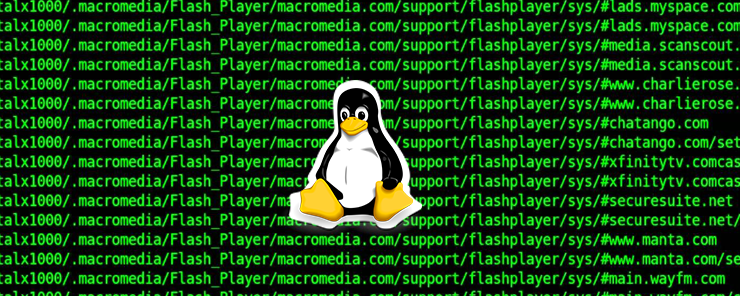

# 0x02. Shell, I/O Redirections and filters

## Author:
* **Noah Tsegay** <[Noaht8](https://github.com/Noaht8)>  😎;



Resources
---------

**Read or watch**:

-   [Shell, I/O Redirection](https://alx-intranet.hbtn.io/rltoken/fGOQQXRKbvOcd1qLRxHzLQ "Shell, I/O Redirection")
-   [Special Characters](https://alx-intranet.hbtn.io/rltoken/c1pz13vke3HPH0S8iALbtw "Special Characters")

**man or help**:

-   `echo` &emsp; Prints text or variables to the terminal.
-   `cat` &emsp; Displays the contents of a file.
-   `head` &emsp; Shows the first lines of a file (default: 10 lines).
-   `tail` &emsp; Shows the last lines of a file (default: 10 lines).
-   `find` &emsp; Searches for files and directories in a path.
-   `wc` &emsp; Counts lines, words, and characters.
-   `sort` &emsp; Sorts lines of text.
-   `uniq` &emsp; Removes duplicate adjacent lines (use with sort).
-   `grep` &emsp; Searches for patterns in files.
-   `tr` &emsp; Translates or deletes characters.
-   `rev` &emsp; Reverses lines character-wise.
-   `cut` &emsp; Cuts sections from each line of input.
```
🔹 What is cut?
cut is a command that extracts specific parts (columns or characters) from each line of a file or text.

🔹 Common Options
-d → sets the delimiter (default is TAB)

-f → choose fields (columns)

-c → choose specific characters

Example:
Suppose users.txt has this:

alice:25:developer
bob:30:designer
carol:28:manager

Show only the names (field 1):

cut -d ":" -f 1 users.txt
# Output:
# alice
# bob
# carol

Show name and age (fields 1 and 2):

cut -d ":" -f 1,2 users.txt
# Output:
# alice:25
# bob:30
# carol:28
```
-   `passwd (5)` (*i.e. `man 5 passwd`*) &emsp; This file stores user account info: one line per user.

Learning Objectives
-------------------

At the end of this project, you are expected to be able to [explain to anyone](https://alx-intranet.hbtn.io/rltoken/WoF77AM7Rz1BcDT4o-_NeA "explain to anyone"), **without the help of Google**:

### Shell, I/O Redirection

-   What do the commands `head`, `tail`, `find`, `wc`, `sort`, `uniq`, `grep`, `tr` do
-   How to redirect standard output to a file
-   How to get standard input from a file instead of the keyboard
-   How to send the output from one program to the input of another program
-   How to combine commands and filters with redirections

### Special Characters

-   What are special characters
-   Understand what do the white spaces, single quotes, double quotes, backslash, comment, pipe, command separator, tilde and how and when to use them

### Other Man Pages

-   How to display a line of text
-   How to concatenate files and print on the standard output
-   How to reverse a string
-   How to remove sections from each line of files
-   What is the `/etc/passwd` file and what is its format
-   What is the `/etc/shadow` file and what is its format

Requirements
------------

### General

-   Allowed editors: `vi`, `vim`, `emacs`
-   All your scripts will be tested on Ubuntu 20.04 LTS
-   All your scripts should be exactly two lines long (`$ wc -l file` should print 2)
-   All your files should end with a new line ([why?](http://unix.stackexchange.com/questions/18743/whats-the-point-in-adding-a-new-line-to-the-end-of-a-file/18789))
-   The first line of all your files should be exactly `#!/bin/bash`
-   A `README.md` file, at the root of the folder of the project, describing what each script is doing
-   You are not allowed to use backticks, `&&`, `||` or `;`
-   All your files must be executable
-   You are not allowed to use `sed` or `awk`

More Info
---------

Read your `/etc/passwd` and `/etc/shadow` files.

Note: You do not have to learn about `fmt`, `pr`, `du`, `gzip`, `tar`, `lpr`, `sed` and `awk` yet.

## Contents
___

This repository contains the following files:

## [0-hello_world](0-hello_world)
Write a script that prints “Hello, World”, followed by a new line to the standard output.
```
julien@ubuntu:/tmp/h$ ./0-hello_world 
Hello, World
julien@ubuntu:/tmp/h$ ./0-hello_world | cat -e
Hello, World$
julien@ubuntu:/tmp/h$
```
## [1-confused_smiley](1-confused_smiley)
Write a script that displays a confused smiley `"(Ôo)'`.
```
julien@ubuntu:/tmp/h$ ./1-confused_smiley 
"(Ôo)'
julien@ubuntu:/tmp/h$
```
## [2-hellofile](2-hellofile)
Display the content of the `/etc/passwd` file.

Example:
```
$ ./2-hellofile
##
# User Database
#
# Note that this file is consulted directly only when the system is running
# in single-user mode. At other times this information is provided by
# Open Directory.
#
# See the opendirectoryd(8) man page for additional information about
# Open Directory.
##
nobody:*:-2:-2:Unprivileged User:/var/empty:/usr/bin/false
root:*:0:0:System Administrator:/var/root:/bin/sh
daemon:*:1:1:System Services:/var/root:/usr/bin/false
_uucp:*:4:4:Unix to Unix Copy Protocol:/var/spool/uucp:/usr/sbin/uucico
_taskgated:*:13:13:Task Gate Daemon:/var/empty:/usr/bin/false
_networkd:*:24:24:Network Services:/var/networkd:/usr/bin/false
_installassistant:*:25:25:Install Assistant:/var/empty:/usr/bin/false
_lp:*:26:26:Printing Services:/var/spool/cups:/usr/bin/false
_postfix:*:27:27:Postfix Mail Server:/var/spool/postfix:/usr/bin/false
_scsd:*:31:31:Service Configuration Service:/var/empty:/usr/bin/false
_ces:*:32:32:Certificate Enrollment Service:/var/empty:/usr/bin/false
_mcxalr:*:54:54:MCX AppLaunch:/var/empty:/usr/bin/false
_krbfast:*:246:-2:Kerberos FAST Account:/var/empty:/usr/bin/false
$
```
## [3-twofiles](3-twofiles)
Display the content of `/etc/passwd` and `/etc/hosts`

Example:
```
$ ./3-twofiles
##
# User Database
#
# Note that this file is consulted directly only when the system is running
# in single-user mode. At other times this information is provided by
# Open Directory.
#
# See the opendirectoryd(8) man page for additional information about
# Open Directory.
##
nobody:*:-2:-2:Unprivileged User:/var/empty:/usr/bin/false
root:*:0:0:System Administrator:/var/root:/bin/sh
daemon:*:1:1:System Services:/var/root:/usr/bin/false
##
# Host Database
#
# localhost is used to configure the loopback interface
# when the system is booting. Do not change this entry.
##
127.0.0.1   localhost
255.255.255.255 broadcasthost
::1 localhost
$
```
## [4-lastlines](4-lastlines)
Display the last 10 lines of `/etc/passwd`

Example:
```
$ ./4-lastlines
_assetcache:*:235:235:Asset Cache Service:/var/empty:/usr/bin/false
_coremediaiod:*:236:236:Core Media IO Daemon:/var/empty:/usr/bin/false
_launchservicesd:*:239:239:_launchservicesd:/var/empty:/usr/bin/false
_iconservices:*:240:240:IconServices:/var/empty:/usr/bin/false
_distnote:*:241:241:DistNote:/var/empty:/usr/bin/false
_nsurlsessiond:*:242:242:NSURLSession Daemon:/var/db/nsurlsessiond:/usr/bin/false
_nsurlstoraged:*:243:243:NSURLStorage Daemon:/var/empty:/usr/bin/false
_displaypolicyd:*:244:244:Display Policy Daemon:/var/empty:/usr/bin/false
_astris:*:245:245:Astris Services:/var/db/astris:/usr/bin/false
_krbfast:*:246:-2:Kerberos FAST Account:/var/empty:/usr/bin/false
```
Tips: “Thinks of it as a cat, what is at the end of it?”
## [5-firstlines](5-firstlines)
Display the first 10 lines of `/etc/passwd`

Example:
```
$ ./5-firstlines
##
# User Database
#
# Note that this file is consulted directly only when the system is running
# in single-user mode. At other times this information is provided by
# Open Directory.
#
# See the opendirectoryd(8) man page for additional information about
# Open Directory.
##
$
```
## [6-third_line](6-third_line)
Write a script that displays the third line of the file `iacta`.

The file `iacta` will be in the working directory

You’re not allowed to use `sed`
```
julien@ubuntu:/tmp/h$ cat iacta 
Alea iacta est

Alea iacta est ("The die is cast") is a Latin phrase attributed by Suetonius
(as iacta alea est) to Julius Caesar on January 10, 49 BC
as he led his army across the Rubicon river in Northern Italy. With this step,
he entered Italy at the head of his army in defiance of the Senate and began
his long civil war against Pompey and the Optimates. The phrase has been
adopted in Italian (Il dado è tratto), Romanian (Zarurile au fost aruncate),
Spanish (La suerte está echada), French (Les dés sont jetés), Portuguese (A
sorte está lançada), Dutch (De teerling is geworpen),
German (Der Würfel ist gefallen), Hungarian (A kocka el van vetve) and many other languages to
indicate that events have passed a point of no return.

Read more: https://en.wikipedia.org/wiki/Alea_iacta_est
julien@ubuntu:/tmp/h$ ./6-third_line 
Alea iacta est ("The die is cast") is a Latin phrase attributed by Suetonius
julien@ubuntu:/tmp/h$
```
Note: The output will differ, depending on the content of the file `iacta`.
## [7-file](7-file)
Write a shell script that creates a file named exactly `\*\\'"Best School"\'\\*$\?\*\*\*\*\*:)` containing the text `Best School` ending by a new line.
```
julien@ubuntu:~/shell$ ls && ./7-file && ls -l && cat -e \\*
0-mac_and_cheese 7-file 7-file~ Makefile
total 20
-rwxrw-r-- 1 julien julien 79 Jan 20 06:24 0-mac_and_cheese
-rwxrw-r-- 1 julien julien 90 Jan 20 06:40 7-file
-rwxrw-r-- 1 julien julien 69 Jan 20 06:37 7-file~
-rw-rw-r-- 1 julien julien 14 Jan 20 06:38 Makefile
-rw-rw-r-- 1 julien julien 17 Jan 20 06:40 '\*\\'"Best School"\'\\*$\?\*\*\*\*\*:)'
Best School$
julien@ubuntu:~/shell$
```
## [8-cwd_state](8-cwd_state)
Write a script that writes into the file `ls_cwd_content` the result of the command `ls -la`. If the file `ls_cwd_content` already exists, it should be overwritten. If the file `ls_cwd_content` does not exist, create it.
```
julien@ubuntu:/tmp/h$ ls -la
total 20
drwxrwxr-x  2 julien julien 4096 Sep 20 18:18 .
drwxrwxrwt 13 root   root   4096 Sep 20 18:18 ..
-rwxrw-r--  1 julien julien   36 Sep 20 18:18 8-cwd_state
-rw-rw-r--  1 betty  julien   23 Sep 20 14:25 hello
-rw-rw-r--  1 julien julien  926 Sep 20 17:52 iacta
julien@ubuntu:/tmp/h$ ./8-cwd_state 
julien@ubuntu:/tmp/h$ ls -la
total 24
drwxrwxr-x  2 julien julien 4096 Sep 20 18:18 .
drwxrwxrwt 13 root   root   4096 Sep 20 18:18 ..
-rwxrw-r--  1 julien julien   36 Sep 20 18:18 8-cwd_state
-rw-rw-r--  1 betty  julien   23 Sep 20 14:25 hello
-rw-rw-r--  1 julien julien  926 Sep 20 17:52 iacta
-rw-rw-r--  1 julien julien  329 Sep 20 18:18 ls_cwd_content
julien@ubuntu:/tmp/h$ cat ls_cwd_content 
total 20
drwxrwxr-x  2 julien julien 4096 Sep 20 18:18 .
drwxrwxrwt 13 root   root   4096 Sep 20 18:18 ..
-rwxrw-r--  1 julien julien   36 Sep 20 18:18 8-cwd_state
-rw-rw-r--  1 betty  julien   23 Sep 20 14:25 hello
-rw-rw-r--  1 julien julien  926 Sep 20 17:52 iacta
-rw-rw-r--  1 julien julien    0 Sep 20 18:18 ls_cwd_content
julien@ubuntu:/tmp/h$
```
## [9-duplicate_last_line](9-duplicate_last_line)
Write a script that duplicates the last line of the file `iacta`

* The file `iacta` will be in the working directory
```
julien@ubuntu:/tmp/h$ cat iacta 
Alea iacta est

Alea iacta est ("The die is cast") is a Latin phrase attributed by Suetonius
(as iacta alea est) to Julius Caesar on January 10, 49 BC
as he led his army across the Rubicon river in Northern Italy. With this step,
he entered Italy at the head of his army in defiance of the Senate and began
his long civil war against Pompey and the Optimates. The phrase has been
adopted in Italian (Il dado è tratto), Romanian (Zarurile au fost aruncate),
Spanish (La suerte está echada), French (Les dés sont jetés), Portuguese (A
sorte está lançada), Dutch (De teerling is geworpen),
German (Der Würfel ist gefallen), Hungarian (A kocka el van vetve) and many other languages to
indicate that events have passed a point of no return.

Read more: https://en.wikipedia.org/wiki/Alea_iacta_est
julien@ubuntu:/tmp/h$ ./9-duplicate_last_line 
julien@ubuntu:/tmp/h$ cat iacta 
Alea iacta est

Alea iacta est ("The die is cast") is a Latin phrase attributed by Suetonius
(as iacta alea est) to Julius Caesar on January 10, 49 BC
as he led his army across the Rubicon river in Northern Italy. With this step,
he entered Italy at the head of his army in defiance of the Senate and began
his long civil war against Pompey and the Optimates. The phrase has been
adopted in Italian (Il dado è tratto), Romanian (Zarurile au fost aruncate),
Spanish (La suerte está echada), French (Les dés sont jetés), Portuguese (A
sorte está lançada), Dutch (De teerling is geworpen),
German (Der Würfel ist gefallen), Hungarian (A kocka el van vetve) and many other languages to
indicate that events have passed a point of no return.

Read more: https://en.wikipedia.org/wiki/Alea_iacta_est
Read more: https://en.wikipedia.org/wiki/Alea_iacta_est
julien@ubuntu:/tmp/h$ 
```
## [10-no_more_js](10-no_more_js)
Write a script that deletes all the regular files (not the directories) with a `.js` extension that are present in the current directory and all its subfolders.
```
julien@ubuntu:/tmp/h$ ls -lR
.:
total 24
-rwxrw-r-- 1 julien julien   49 Sep 20 18:29 10-no_more_js
drwxrwxr-x 2 julien julien 4096 Sep 20 18:23 dir1
drwxrwxr-x 2 julien julien 4096 Sep 20 18:24 dir.js
-rw-rw-r-- 1 betty  julien   23 Sep 20 14:25 hello
-rw-rw-r-- 1 julien julien  982 Sep 20 18:21 iacta
-rw-rw-r-- 1 julien julien  329 Sep 20 18:18 ls_cwd_content
-rw-rw-r-- 1 julien julien    0 Sep 20 18:23 main.js

./dir1:
total 0
-rw-rw-r-- 1 julien julien 0 Sep 20 18:23 code.js

./dir.js:
total 0
julien@ubuntu:/tmp/h$ ./10-no_more_js 
julien@ubuntu:/tmp/h$ ls -lR
.:
total 24
-rwxrw-r-- 1 julien julien   49 Sep 20 18:29 10-no_more_js
drwxrwxr-x 2 julien julien 4096 Sep 20 18:29 dir1
drwxrwxr-x 2 julien julien 4096 Sep 20 18:24 dir.js
-rw-rw-r-- 1 betty  julien   23 Sep 20 14:25 hello
-rw-rw-r-- 1 julien julien  982 Sep 20 18:21 iacta
-rw-rw-r-- 1 julien julien  329 Sep 20 18:18 ls_cwd_content

./dir1:
total 0

./dir.js:
total 0
julien@ubuntu:/tmp/h$
```
## [11-directories](11-directories)
## [12-newest_files](12-newest_files)
## [13-unique](13-unique)
## [14-findthatword](14-findthatword)
## [15-countthatword](15-countthatword)
## [16-whatsnext](16-whatsnext)
## [17-hidethisword](17-hidethisword)
## [18-letteronly](18-letteronly)
## [19-AZ](19-AZ)
## [20-hiago](20-hiago)
## [21-reverse](21-reverse)
## [22-users_and_homes](22-users_and_homes)
## [100-empty_casks](100-empty_casks)
## [101-gifs](101-gifs)
## [102-acrostic](102-acrostic)
## [103-the_biggest_fan](103-the_biggest_fan)
