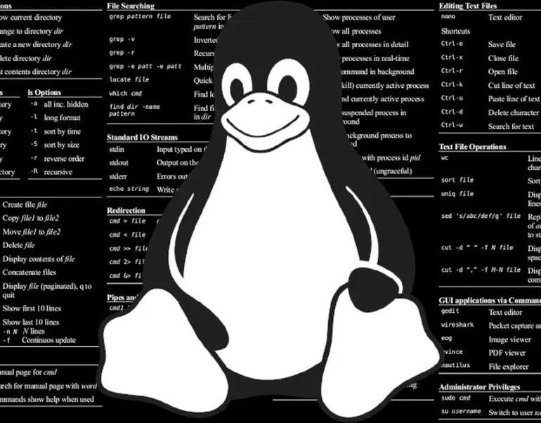

# 0x03-shell_variables_expansions   

## Author: **Noah Tsegay** <[Noaht8](https://github.com/Noaht8)>  😎;


Resources
---------

**Read or watch**:

-   [Expansions](https://linuxcommand.org/lc3_lts0080.php)
-   [Shell Arithmetic](https://www.gnu.org/software/bash/manual/html_node/Shell-Arithmetic.html)
-   [Variables](https://alx-intranet.hbtn.io/rltoken/SvdGNZJjKsPghzZEhaWu4Q "Variables")
-   [Shell initialization files](https://alx-intranet.hbtn.io/rltoken/tqud57kjsSYgDfeZDlwl3g "Shell initialization files")
-   [The alias Command](https://alx-intranet.hbtn.io/rltoken/zCemKQ8f1CxmODIs9dmcWg "The alias Command")
-   [Technical Writing](https://alx-intranet.hbtn.io/rltoken/gzXkaQsMeeNHSK3LbaKZeQ "Technical Writing")

**man or help**:

-   `printenv` &emsp; Shows environment variables (like PATH, HOME, etc.).
-   `set` &emsp; Shows all shell variables, including environment variables and user-defined ones. It can also be used to set shell options.
-   `unset` &emsp; Removes (deletes) a variable or function.
-   `export` &emsp; Marks a variable so that it’s passed to child processes (like other scripts).
```
MY_VAR="hello"
export MY_VAR

➡️ Now $MY_VAR will be available in any script or program you run.
```
-   `alias` &emsp; Creates a shortcut for a command.
-   `unalias` &emsp; Removes an alias.
-   `.` &emsp; Same as source. Runs a script in the current shell, not in a sub-shell.
```
. myscript.sh

➡️ Executes myscript.sh and keeps any variables it sets.
```
-   `source` &emsp; Same as `.` but more readable. Used to load files or scripts into the current shell.
```
source ~/.bashrc

➡️ Loads your shell configuration changes immediately.
```
-   `printf` &emsp; Formats and prints text (like C’s printf, more flexible than echo).

Learning Objectives
-------------------

At the end of this project, you are expected to be able to [explain to anyone](https://alx-intranet.hbtn.io/rltoken/RVM7z2LM2TRjYWc2IK0Rfw "explain to anyone"), **without the help of Google**:

### General

-   What happens when you type `$ ls -l *.txt`

### Shell Initialization Files

-   What are the `/etc/profile` file and the `/etc/profile.d` directory
-   What is the `~/.bashrc` file

### Variables

-   What is the difference between a local and a global variable
-   What is a reserved variable
-   How to create, update and delete shell variables
-   What are the roles of the following reserved variables: HOME, PATH, PS1
-   What are special parameters
-   What is the special parameter `$?`?

### Expansions

-   What is expansion and how to use them
-   What is the difference between single and double quotes and how to use them properly
-   How to do command substitution with `$()` and backticks

### Shell Arithmetic

-   How to perform arithmetic operations with the shell

### The `alias` Command

-   How to create an alias
-   How to list aliases
-   How to temporarily disable an alias

### Other `help` pages

-   How to execute commands from a file in the current shell

Requirements
------------

### General

-   Allowed editors: `vi`, `vim`, `emacs`
-   All your scripts will be tested on Ubuntu 20.04 LTS
-   All your scripts should be exactly two lines long (`$ wc -l file` should print 2)
-   All your files should end with a new line ([why?](http://unix.stackexchange.com/questions/18743/whats-the-point-in-adding-a-new-line-to-the-end-of-a-file/18789))
-   The first line of all your files should be exactly `#!/bin/bash`
-   A `README.md` file, at the root of the folder of the project, describing what each script is doing
-   You are not allowed to use `&&`, `||` or `;`
-   You are not allowed to use `bc`, `sed` or `awk`
-   All your files must be executable

More Info
---------

Read your `/etc/profile`, `/etc/inputrc` and `~/.bashrc` files.

Look at some files in the `/etc/profile.d` directory.

Note: You do not have to learn about `awk`, `tar`, `bzip2`, `date`, `scp`, `ulimit`, `umask`, or shell scripting, yet.

## Contents
___

### This repository contains the following files:

## [0-alias](0-alias)
Create a script that creates an alias.

-   Name: `ls`
-   Value: `rm *`

```
julien@ubuntu:/tmp/0x03$ ls
0-alias  file1  file2
julien@ubuntu:/tmp/0x03$ source ./0-alias
julien@ubuntu:/tmp/0x03$ ls
julien@ubuntu:/tmp/0x03$ \ls
julien@ubuntu:/tmp/0x03$

```
## [1-hello_you](1-hello_you)
Create a script that prints `hello user`, where user is the current Linux user.

```
julien@ubuntu:/tmp/0x03$ id
uid=1000(julien) gid=1000(julien) groups=1000(julien),4(adm),24(cdrom),27(sudo),30(dip),46(plugdev),113(lpadmin),128(sambashare)
julien@ubuntu:/tmp/0x03$ ./1-hello_you
hello julien
julien@ubuntu:/tmp/0x03$

```
## [2-path](2-path)
Add `/action` to the `PATH`. `/action` should be the last directory the shell looks into when looking for a program.

```
julien@ubuntu:/tmp/0x03$ echo $PATH
/home/julien/bin:/home/julien/.local/bin:/usr/local/sbin:/usr/local/bin:/usr/sbin:/usr/bin:/sbin:/bin:/usr/games:/usr/local/games:/snap/bin
julien@ubuntu:/tmp/0x03$ source ./2-path
julien@ubuntu:/tmp/0x03$ echo $PATH
/home/julien/bin:/home/julien/.local/bin:/usr/local/sbin:/usr/local/bin:/usr/sbin:/usr/bin:/sbin:/bin:/usr/games:/usr/local/games:/snap/bin:/action
julien@ubuntu:/tmp/0x03$

```
## [3-paths](3-paths)
Create a script that counts the number of directories in the `PATH`.

```
julien@ubuntu:/tmp/0x03$ echo $PATH
/home/julien/bin:/home/julien/.local/bin:/usr/local/sbin:/usr/local/bin:/usr/sbin:/usr/bin:/sbin:/bin:/usr/games:/usr/local/games:/snap/bin
julien@ubuntu:/tmp/0x03$ . ./3-paths
11
julien@ubuntu:/tmp/0x03$ PATH=/home/julien/bin:/home/julien/.local/bin:/usr/local/sbin:/usr/local/bin:/usr/sbin:/usr/bin:/sbin:/bin:/usr/games:/usr/local/games:/snap/bin:::::/hello
julien@ubuntu:/tmp/0x03$ . ./3-paths
12
julien@ubuntu:/tmp/0x03$

```
## [4-global_variables](4-global_variables)
Create a script that lists environment variables.

```
julien@ubuntu:/tmp/0x03$ source ./4-global_variables
CC=gcc
CDPATH=.:~:/usr/local:/usr:/
CFLAGS=-O2 -fomit-frame-pointer
COLORTERM=gnome-terminal
CXXFLAGS=-O2 -fomit-frame-pointer
DISPLAY=:0
DOMAIN=hq.garrels.be
e=
TOR=vi
FCEDIT=vi
FIGNORE=.o:~
G_BROKEN_FILENAMES=1
GDK_USE_XFT=1
GDMSESSION=Default
GNOME_DESKTOP_SESSION_ID=Default
GTK_RC_FILES=/etc/gtk/gtkrc:/nethome/franky/.gtkrc-1.2-gnome2
GWMCOLOR=darkgreen
GWMTERM=xterm
HISTFILESIZE=5000
history_control=ignoredups
HISTSIZE=2000
HOME=/nethome/franky
HOSTNAME=octarine.hq.garrels.be
INPUTRC=/etc/inputrc
IRCNAME=franky
JAVA_HOME=/usr/java/j2sdk1.4.0
LANG=en_US
LDFLAGS=-s
LD_LIBRARY_PATH=/usr/lib/mozilla:/usr/lib/mozilla/plugins
LESSCHARSET=latin1
LESS=-edfMQ
LESSOPEN=|/usr/bin/lesspipe.sh %s
LEX=flex
LOCAL_MACHINE=octarine
LOGNAME=franky
[...]
julien@ubuntu:/tmp/0x03$

```
## [5-local_variables](5-local_variables)
Create a script that lists all local variables and environment variables, and functions.

```
julien@ubuntu:/tmp/0x03$ . ./5-local_variables
BASH=/bin/bash
BASHOPTS=checkwinsize:cmdhist:complete_fullquote:expand_aliases:extglob:extquote:force_fignore:histappend:interactive_comments:progcomp:promptvars:sourcepath
BASH_ALIASES=()
BASH_ARGC=()
BASH_ARGV=()
BASH_CMDS=()
BASH_COMPLETION_COMPAT_DIR=/etc/bash_completion.d
BASH_LINENO=()
BASH_REMATCH=()
BASH_SOURCE=()
BASH_VERSINFO=([0]="4" [1]="3" [2]="46" [3]="1" [4]="release" [5]="x86_64-pc-linux-gnu")
BASH_VERSION='4.3.46(1)-release'
CLUTTER_IM_MODULE=xim
COLUMNS=133
COMPIZ_CONFIG_PROFILE=ubuntu
COMP_WORDBREAKS=$' \t\n"\'><=;|&(:'
DBUS_SESSION_BUS_ADDRESS=unix:abstract=/tmp/dbus-Fg27Lr20bq
DEFAULTS_PATH=/usr/share/gconf/ubuntu.default.path
DESKTOP_SESSION=ubuntu
[...]
julien@ubuntu:/tmp/0x03$

```
## [6-create_local_variable](6-create_local_variable)
Create a script that creates a new local variable.

-   Name: `BETTY`
-   Value: `Holberton`
## [7-create_global_variable](7-create_global_variable)
Create a script that creates a new global variable.

-   Name: `HOLBERTON`
-   Value: `Betty`
## [8-true_knowledge](8-true_knowledge)
Write a script that prints the result of the addition of 128 with the value stored in the environment variable `TRUEKNOWLEDGE`, followed by a new line.

```
julien@production-503e7013:~$ export TRUEKNOWLEDGE=1209
julien@production-503e7013:~$ ./8-true_knowledge | cat -e
1337$
julien@production-503e7013:~$

```
## [9-divide_and_rule](9-divide_and_rule)
Write a script that prints the result of `POWER` divided by `DIVIDE`, followed by a new line.

-   `POWER` and `DIVIDE` are environment variables

```
julien@production-503e7013:~$ export POWER=42784
julien@production-503e7013:~$ export DIVIDE=32
julien@production-503e7013:~$ ./9-divide_and_rule | cat -e
1337$
julien@production-503e7013:~$

```
## [10-love_exponent_breath](10-love_exponent_breath)
Write a script that displays the result of `BREATH` to the power `LOVE`

-   `BREATH` and `LOVE` are environment variables
-   The script should display the result, followed by a new line

```
julien@production-503e7013:~/$ export BREATH=4
julien@production-503e7013:~/$ export LOVE=3
julien@production-503e7013:~/$ ./10-love_exponent_breath
64
julien@production-503e7013:~/$

```
## [11-binary_to_decimal](11-binary_to_decimal)
Write a script that converts a number from base 2 to base 10.

-   The number in base 2 is stored in the environment variable `BINARY`
-   The script should display the number in base 10, followed by a new line

```
julien@production-503e7013:~/$ export BINARY=10100111001
julien@production-503e7013:~/$ ./11-binary_to_decimal
1337
julien@production-503e7013:~/$

```
### Solution (Plus)
```
echo $((2#$BINARY))
```
-  `2#$BINARY` → tells Bash to interpret the value as base-2.

-  `$(( ... ))` → arithmetic expansion evaluates and converts it to decimal.

-  `echo` → prints the result.

#### To convert `base 2` to `base 10`

`echo "ibase=2; 0111" | bc`

-  `ibase=2` → sets input base.

-  `$DECIMAL` → the decimal number from your variable.

-  `bc` → the command-line calculator that does the conversion.

-  result is 7

#### To convert `base 10` to `base 2`

`echo "obase=2; 7" | bc`

-  result is 0111

  


## [12-combinations](12-combinations)
Create a script that prints all possible combinations of two letters, except `oo`.

-   Letters are lower cases, from `a` to `z`
-   One combination per line
-   The output should be alpha ordered, starting with `aa`
-   Do not print `oo`
-   Your script file should contain maximum 64 characters

```
julien@ubuntu:/tmp/0x03$ echo $((26 ** 2 -1))
675
julien@ubuntu:/tmp/0x03$ ./12-combinations | wc -l
675
julien@ubuntu:/tmp/0x03$
julien@ubuntu:/tmp/0x03$ ./12-combinations | tail -303 | head -10
oi
oj
ok
ol
om
on
op
oq
or
os
julien@ubuntu:/tmp/0x03$

```

## [13-print_float](13-print_float)
Write a script that prints a number with two decimal places, followed by a new line.

The number will be stored in the environment variable `NUM`.

```
ubuntu@ip-172-31-63-244:~/0x03$ export NUM=0
ubuntu@ip-172-31-63-244:~/0x03$ ./13-print_float
0.00
ubuntu@ip-172-31-63-244:~/0x03$ export NUM=98
ubuntu@ip-172-31-63-244:~/0x03$ ./13-print_float
98.00
ubuntu@ip-172-31-63-244:~/0x03$ export NUM=3.14159265359
ubuntu@ip-172-31-63-244:~/0x03$ ./13-print_float
3.14
ubuntu@ip-172-31-63-244:~/0x03$

```
## [100-decimal_to_hexadecimal](100-decimal_to_hexadecimal)
Write a script that converts a number from base 10 to base 16.

-   The number in base 10 is stored in the environment variable `DECIMAL`
-   The script should display the number in base 16, followed by a new line

```
julien@production-503e7013:~/$ export DECIMAL=16
julien@production-503e7013:~/$ ./100-decimal_to_hexadecimal
10
julien@production-503e7013:~/$ export DECIMAL=1337
julien@production-503e7013:~/$ ./100-decimal_to_hexadecimal | cat -e
539$
julien@production-503e7013:~/$ export DECIMAL=15
julien@production-503e7013:~/$ ./100-decimal_to_hexadecimal | cat -e
f$
julien@production-503e7013:~/$

```
## [101-rot13](101-rot13)
Write a script that encodes and decodes text using the rot13 encryption. Assume ASCII.

```
julien@production-503e7013:~/shell/fun_with_the_shell$ cat quote
"Everyone is a proponent of strong encryption."
- Dorothy E. Denning
julien@production-503e7013:~/shell/fun_with_the_shell$ ./101-rot13 < quote
"Rirelbar vf n cebcbarag bs fgebat rapelcgvba."
- Qbebgul R. Qraavat
julien@production-503e7013:~/shell/fun_with_the_shell$

```
#### Solution Notes
Letters `A-Z` are mapped to `N-Z` then `A-M`.
Same for lowercase `a-z` → `n-z` then `a-m`.
## [102-odd](102-odd)
Write a script that prints every other line from the input, starting with the first line.

```
ubuntu@ip-172-31-63-244:/$ \ls -1
bin
boot
dev
etc
home
initrd.img
lib
lib32
lib64
libx32
lost+found
media
mnt
opt
proc
root
run
sbin
srv
sys
t
#t#
t~
tmp
usr
var
vmlinuz
whoareyou
ubuntu@ip-172-31-63-244:/$ \ls -1 | ./102-odd
bin
dev
home
lib
lib64
lost+found
mnt
proc
run
srv
t
t~
usr
vmlinuz
ubuntu@ip-172-31-63-244:/$

```
## [103-water_and_stir](103-water_and_stir)
Write a shell script that adds the two numbers stored in the environment variables `WATER` and `STIR` and prints the result.

-   `WATER` is in base `water`
-   `STIR` is in base `stir.`
-   The result should be in base `bestchol`

```
julien@production-503e7013:~$ export WATER="ewwatratewa"
julien@production-503e7013:~$ export STIR="ti.itirtrtr"
julien@production-503e7013:~$ ./103-water_and_stir
holberton
julien@production-503e7013:~$

```


