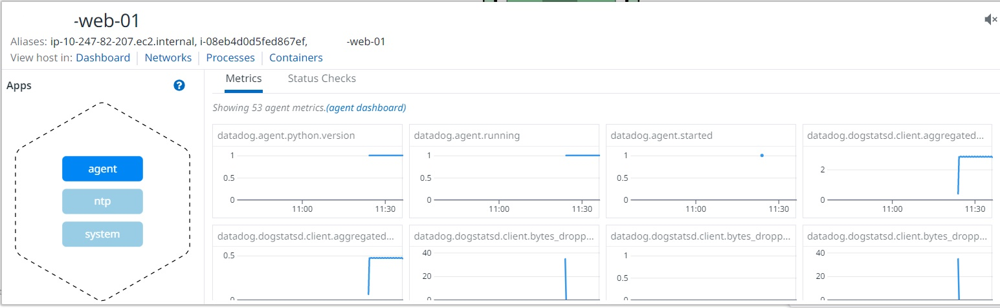
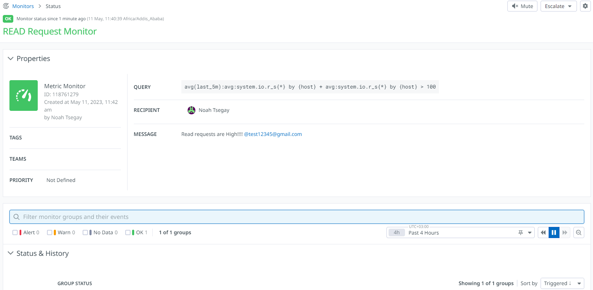
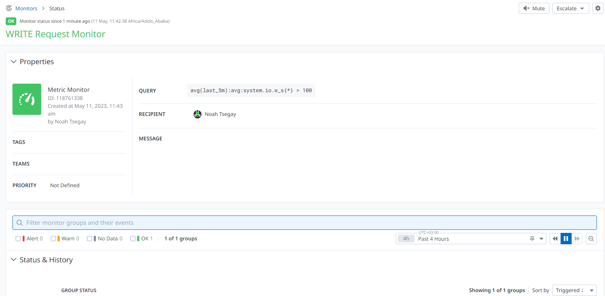
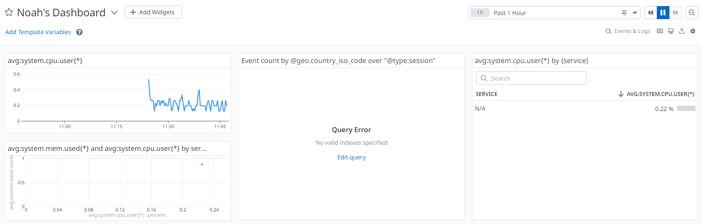

# 0x18. Webstack monitoring


## Author:
* **Noah Tsegay** <[Noaht8](https://github.com/Noaht8)>  &#128511;

## Directory Contents
___

## Task 0

Sign up for Datadog - Please make sure you are using the US website of Datadog (.com)<br>
Install ```datadog-agent``` on ```web-01```<br>
Create an ```application key```<br>
Copy-paste in your Intranet user profile your DataDog ```API key``` and your DataDog ```application key```.<br>
Your server ```web-01``` should be visible in Datadog under the host name ```XX-web-01```<br>
* You can validate it by using datadog API<br>
* If needed, you will need to update the hostname of your server



## Task 1

### Set up a monitor that checks the number of read requests issued to the device per second.


### Set up a monitor that checks the number of write requests issued to the device per second.


## Task 2

### Dashboard with different metrics displayed in order to get a few different visualizations.


